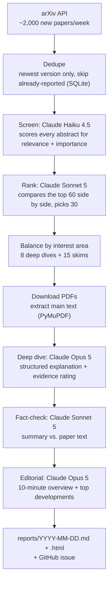

# AI Research Radar

**A weekly, evidence-first AI research briefing, written for one reader.**

Every week, AI Research Radar:

1. Collects about 2,000 new arXiv papers.
2. Scores every abstract against your interests.
3. Picks the most important papers.
4. Reads the best ones in full.
5. Writes one report in Markdown and HTML.

Every deep dive is fact-checked against the paper's own text. Results are attributed to the authors ("the authors report…"), never stated as established fact.

📄 **Sample output:** [`examples/sample-report.md`](examples/sample-report.md) is a real run from the week ending 2026-09-26. It covered 1,948 papers, went into 2 in depth and cost $1.76.

---

## What you get

Each report contains:

| Section | What's in it |
|---|---|
| **This week in 10 minutes** | A short editorial, the 3–5 most important developments, and cross-cutting trends |
| **Papers explained** (8 by default) | For each paper: the problem, what's new, how it works, the evidence and whether it holds up, limitations, related work, *why this matters to you*, and one thing to try. It also shows an **evidence-strength rating**, publication status, code links, and any **fact-check flags** |
| **Worth skimming** (15) | Two-sentence summaries of the next-best papers |
| **Conference papers** | Papers whose arXiv metadata says they were accepted at or submitted to NeurIPS, ICML, ICLR, CVPR, ACL, EMNLP, MICCAI, … |

An excerpt from the sample report:

> ### 1. Recursive self-improvement of AI research agents
> Dhruv Srikanth, Bingchen Zhao, … · **Preprint** · evidence: **moderate** · Agents, RAG, evals, reliability & security
>
> **TL;DR** — An agent rewrites its own harness code, keeping rewrites that improve held-out grades on AI R&D tasks; seven accepted edits beat a human-engineered production agent on four external benchmarks.
>
> **Evidence.** Authors report the incumbent private grade rising 0.703→0.778 over 100 outer steps … Multiple benchmarks and a genuinely strong human baseline support the transfer claim; there are no ablations isolating which of the seven rewrites matter, and WeatherBench rests on one task.
>
> **Why this matters to Arpan.** The discovered changes are exactly the harness problems you hit building agents: plateau escape via strategy-level bandits, bounded role-specific prompts with bug-rate-gated failure memory …
>
> ⚠️ **Verifier flags** — *overstated* (tldr): “seven accepted edits beat a human-engineered production agent…” — The paper consistently uses the more cautious phrasing that AIDE85 'matches or exceeds' AIDEhuman…

That last flag was caught by the fact-checker. The summary said "beat" where the paper only claims "matches or exceeds". The report shows the flag rather than hiding it.

---

## How it works



It is a deterministic Python pipeline with typed LLM calls, not an agent framework. Each model call returns a Pydantic schema through Claude's structured outputs, so every stage is predictable and testable.

### Key design decisions

- **Cheap wide screening, then an expensive close look.** Haiku reads all ~2,000 abstracts and returns scores only. Scoring each abstract on its own is noisy, though: scores drift between batches, and dramatic abstracts get overrated. So a stronger model makes the final choice by comparing the top 60 candidates side by side, and it is told to rank hype and claims without experiments lower.
- **Interest areas are enforced in code, not left to the model.** Deep dives and skims are split by your area shares (default 35/25/20/10/10), so a flood of agent papers can't crowd out pathology.
- **Grounded writing.** The deep-dive model sees only the paper text, is told never to add numbers or comparisons that aren't in it, and must attribute results to the authors. It also rates the strength of the evidence: strong, moderate or weak.
- **An independent fact-check.** A second model compares each summary with the paper. The fact-checker is only allowed to judge the summary, not the paper, and the code discards any flag that doesn't quote the summary word for word. Flags appear in the report.
- **Honest about what was read.** Each deep dive notes whether it came from the full text, from the main text with appendices skipped, or from the abstract only if the PDF failed.
- **Publication status is labelled as author-reported.** It comes from arXiv comments such as "Accepted at MICCAI 2026" and is not checked against the official proceedings.
- **Refusal fallbacks.** Opus 5 calls opt into server-side fallbacks (`fallbacks: "default"`). A rare false positive from a safety filter therefore doesn't drop a paper.

---

## Quick start

### 1. Install

You need [uv](https://docs.astral.sh/uv/) and Python 3.12 or newer.

```bash
git clone https://github.com/ArpanKumarM/ai-research-radar.git
cd ai-research-radar
uv sync
```

### 2. Try it for free (no API key)

```bash
uv run radar --dry-run
open reports/$(date +%F).html
```

A dry run fetches real papers from arXiv and ranks them by keyword match. It makes no model calls, so it's a good way to check that everything is set up. The report will contain abstracts instead of explanations.

### 3. Add your Anthropic API key

```bash
echo "ANTHROPIC_API_KEY=sk-ant-..." > .env
```

Get a key at [console.anthropic.com](https://console.anthropic.com). API usage is billed separately from a Claude Pro/Max subscription. `.env` is git-ignored.

### 4. Run it

```bash
# A cheap first run: only 300 papers, 2 deep dives (~$0.70)
uv run radar --max-results 300 --deep 2

# A full weekly run: ~2,000 papers, 8 deep dives (~$3)
uv run radar

open reports/$(date +%F).html
```

### CLI options

```
uv run radar [--dry-run] [--days N] [--max-results N] [--deep N] [--date YYYY-MM-DD] [--config PATH] [-v]
```

| Flag | Effect |
|---|---|
| `--dry-run` | No model calls; ranks by keyword score only |
| `--days N` | Look back N days instead of 7 |
| `--max-results N` | Fetch at most N papers (handy for cheap tests) |
| `--deep N` | Number of full-text deep dives |
| `--date` | Report date; the default is today in the configured timezone |

---

## Run it every week (GitHub Actions)

The workflow `.github/workflows/weekly.yml` runs **every Sunday at 08:00 Phoenix time**. It:

1. generates the report,
2. commits `reports/` and `data/radar.db` back to the repo (so papers aren't repeated in later weeks),
3. opens a GitHub issue containing the report. You'll receive it as a GitHub notification or email.

To enable it, add a repository secret named `ANTHROPIC_API_KEY` under **Settings → Secrets and variables → Actions**. You can also start a run by hand from the **Actions** tab (**Run workflow**), with an optional dry-run toggle.

---

## Configuration

Everything is in [`config.yaml`](config.yaml):

```yaml
reader:
  name: Arpan
  profile: >            # who the report is for: drives scoring and "why this matters"
    ML engineer building LLM agents (MCP/A2A), RAG systems and evaluation harnesses, ...

areas:                  # interest areas; `share` sets how many slots each gets
  agents_rag_reliability:  { share: 0.35, keywords: [...] }
  vision_multimodal_bio:   { share: 0.25, keywords: [...] }
  ...

pipeline:
  deep_dives: 8
  skim: 15

models:
  triage: claude-haiku-4-5     # screens every abstract
  judge:  claude-sonnet-5      # ranks the shortlist, fact-checks deep dives
  writer: claude-opus-5        # deep dives + editorial
```

To make it yours, rewrite `reader.profile` and adjust `areas`. Everything else can stay as it is.

---

## Cost

| Stage | Model | Approx. cost per week |
|---|---|---:|
| Screen ~2,000 abstracts | Haiku 4.5 | $1.05 |
| Rank the top 60 | Sonnet 5 | $0.15 |
| 8 deep dives + editorial | Opus 5 | $1.30 |
| Fact-check 8 deep dives | Sonnet 5 | $0.55 |
| **Total** | | **~$3/week (~$13/month)** |

Ways to reduce it:

- `models.writer: claude-sonnet-5` saves about $0.70/week.
- A lower `deep_dives` saves about $0.20 per paper.
- `prefilter_keep: 400` screens only the 400 best keyword matches. That saves about $0.80/week, but papers that don't use your keywords can be missed.

Each run prints its exact cost at the top of the report and records it in the `runs` table of `data/radar.db`. The run log also shows a cost breakdown by model.

---

## Project layout

```
ai-research-radar/
├── config.yaml                  # reader profile, interest areas, models, sizes
├── src/ai_research_radar/
│   ├── __init__.py              # CLI entry point (`radar`)
│   ├── pipeline.py              # the weekly run, stage by stage
│   ├── arxiv.py                 # arXiv API client + Atom parsing
│   ├── paper.py                 # Paper record, venue-status + link extraction
│   ├── prefilter.py             # keyword area assignment, area-balanced selection
│   ├── llm.py                   # all Claude calls + output schemas
│   ├── fulltext.py              # PDF download + main-text extraction
│   ├── store.py                 # SQLite history (papers, report items, runs)
│   ├── report.py                # Markdown/HTML rendering
│   └── templates/               # Jinja2 report templates
├── tests/test_pipeline.py       # includes a full run with a fake Claude client
├── examples/sample-report.*     # a real generated report
└── .github/workflows/weekly.yml # Sunday schedule
```

## Tests

```bash
uv run pytest
```

The tests cover arXiv parsing, venue detection, area balancing, and a complete pipeline run with a fake Claude client. That run exercises every stage and the report template without network access or API cost.

---

## Limitations

- **arXiv only.** Model and dataset releases announced on lab blogs aren't covered yet.
- **Screening uses the abstract only.** A strong paper with a weak abstract can still be missed.
- **Publication status is what the authors report** on arXiv. It is not checked against the official proceedings.
- **Tables and figures aren't read.** Deep dives use extracted text, so information that appears only in figures, and some table formatting, is lost.
- **The fact-checker is good but not perfect.** Treat its flags as prompts to check the paper yourself.

## Roadmap

- [ ] Lab blog/RSS feeds for model, dataset and benchmark releases
- [ ] Early-importance signals: Hugging Face Daily Papers upvotes, GitHub stars, Semantic Scholar/OpenAlex metadata
- [ ] Venue verification against OpenReview, CVF Open Access, ACL Anthology and NeurIPS proceedings
- [ ] 👍/👎 feedback on papers, fed back into ranking
- [ ] A labelled evaluation set to measure selection quality
- [ ] Searchable history and chat over past reports
